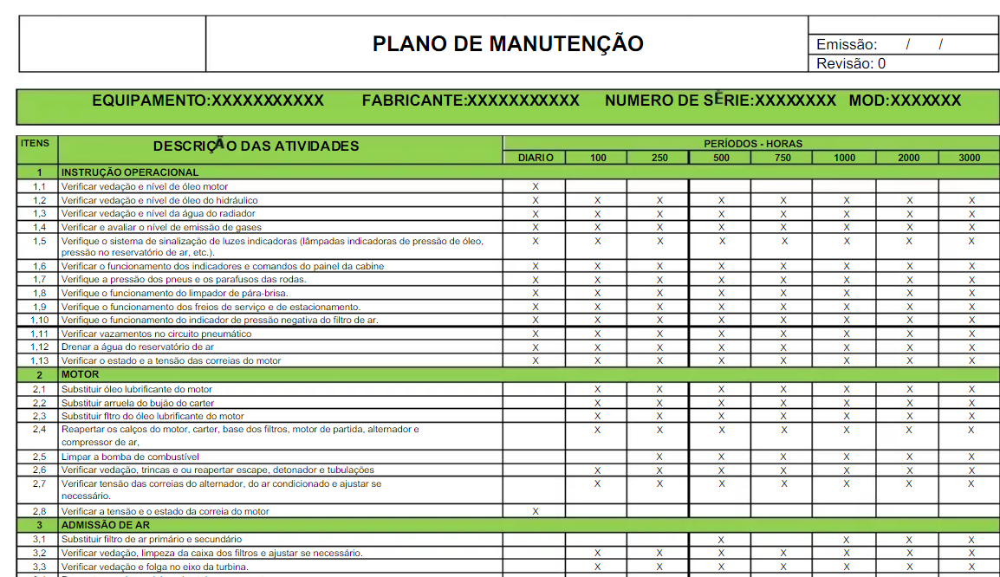

# Plano de Manutenção

O plano de manutenção de equipamentos é um documento que contém um mapeamento e uma programação para a realização de vistorias no maquinário das empresas. É elaborado para manter a funcionalidade e conservar a segurança de equipamentos fabris, frota de veículos e até sistemas de ar-condicionados.

Contém um cronograma com a periodicidade das manutenções e outros serviços necessários para assegurar a qualidade do trabalho dos equipamentos e ativos. Nele também são indicados os responsáveis por executar cada ação.

O plano contém medidas relacionadas a quatro tipos de manutenção:

* Preditiva;
* Preventiva;
* Planejada; e
* Corretiva.

  